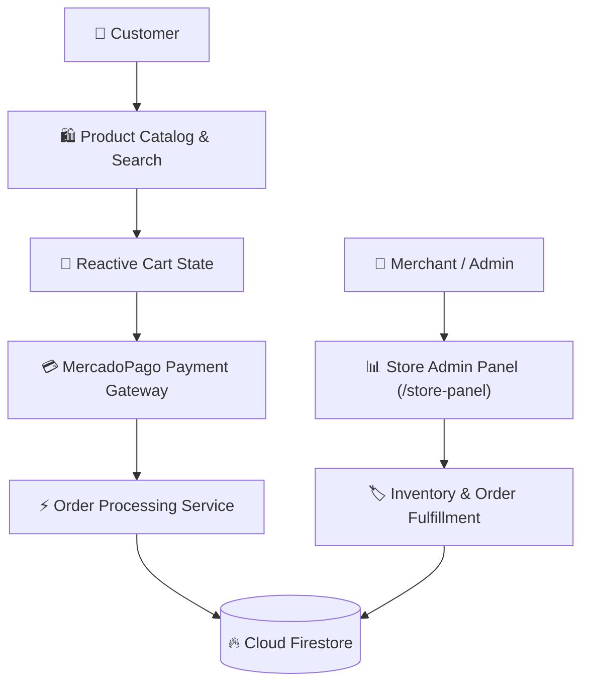

# 🛒 MX-Store (Full-Stack E-Commerce & Checkout Platform)

[](https://angular.io)
[](https://firebase.google.com)
[](https://www.mercadopago.com)
[](LICENSE)

A complete e-commerce single-page application built with **Angular 12** and **Firebase**, featuring product catalog browsing, real-time stock sync, shopping cart state management, appointment scheduling, and integrated payment processing with **MercadoPago**.

---

## 💡 Architectural Overview



---

## ✨ Key Features & Capabilities

- 🛍️ **Dynamic Product Catalog:** Live category filtering, search autocomplete, and product variants.
- 💳 **MercadoPago Payment Gateway:** Seamless checkout integration supporting credit/debit cards and cash vouchers with webhooks.
- 📅 **Interactive Appointment Calendar:** Integrated FullCalendar (`@fullcalendar/angular`) for scheduling service times and store pickups.
- 👔 **Store Management Dashboard:** Dedicated administrative panel (`/panel` and `/store-panel`) for catalog management and order tracking.
- 🔥 **Serverless Backend:** Real-time data persistence powered by Cloud Firestore and Firebase Storage.

---

## 📁 Project Structure

```plaintext
mx-store/
│
├── src/
│   ├── app/
│   │   ├── public/            # Customer storefront & checkout views
│   │   ├── panel/             # General management views
│   │   ├── store-panel/       # Merchant store & inventory dashboard
│   │   ├── gdev-components/   # Reusable UI widgets & modals
│   │   ├── shared/            # Shared services, guards, and interceptors
│   │   ├── app-routing.module.ts
│   │   └── app.module.ts
│   │
│   ├── environments/          # Firebase & MercadoPago configuration
│   │   ├── environment.ts
│   │   └── environment.prod.ts
│   │
│   ├── styles.scss            # Global styling & Material theme
│   ├── main.ts
│   └── index.html
│
├── angular.json               # Angular CLI configuration
├── firebase.json              # Firebase hosting and rules config
├── package.json               # Dependencies & scripts
└── tsconfig.json              # TypeScript compilation config
```

---

## 🚀 Development & Angular CLI Commands

This project was generated with [Angular CLI](https://github.com/angular/angular-cli) version 12.2.8.

### Development Server
Run:
```bash
npm start
# or:
ng serve
```
Navigate to `http://localhost:4200/`. The app will automatically reload if you change any of the source files.

### Code Scaffolding
Run `ng generate component component-name` to generate a new component. You can also use:
```bash
ng generate directive|pipe|service|class|guard|interface|enum|module
```

### Build
Run `ng build` to build the project. The build artifacts will be stored in the `dist/` directory.

### Running Unit Tests
Run `ng test` to execute the unit tests via [Karma](https://karma-runner.github.io).

### Running End-to-End Tests
Run `ng e2e` to execute end-to-end tests via your preferred test runner.

---

## 📄 License

Distributed under the [MIT License](LICENSE). Created by [Jorge Guzmán (@jgu7man)](https://github.com/jgu7man).
